  

  
  
  
  
  

<table>
<tr>
<td width="50%" valign="top">

### Current build

**Project OS**

Persistent project intelligence for humans and AI engineering agents.

`evidence` `context` `project knowledge` `execution` `verification`

</td>
<td width="50%" valign="top">

### Engineering focus

`reverse engineering` `software architecture`

`legacy modernization` `developer tooling`

`AI assisted engineering` `automation`

</td>
</tr>
</table>

<picture>
  <source media="(prefers-color-scheme: dark)" srcset="https://raw.githubusercontent.com/SimonaNaumovska/SimonaNaumovska/output/github-snake-dark.svg" />
  <source media="(prefers-color-scheme: light)" srcset="https://raw.githubusercontent.com/SimonaNaumovska/SimonaNaumovska/output/github-snake.svg" />
  
</picture>

AWS Certified Solutions Architect, Associate · Oracle Certified Associate, Java SE 8 Programmer
